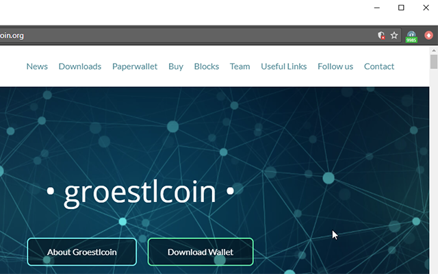
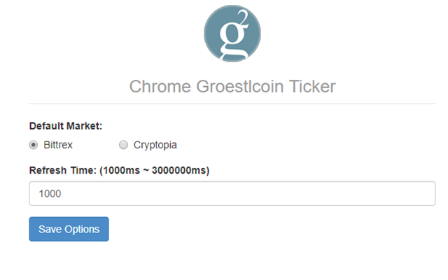

## A simple Chrome Extension showing current Groestlcoin price ticker.


### Chrome Web Store
[https://chrome.google.com/webstore/detail/chrome-groestlcoin-ticker/mhpjbppfbknblbhlingbfofoghnldmek](https://chrome.google.com/webstore/detail/chrome-groestlcoin-ticker/mhpjbppfbknblbhlingbfofoghnldmek)

### Screenshot:





### Markets (so far):
 
* Bittrex
* Cryptopia

### Usage:

1. Open `chrome://extensions/` with your Chrome Browser.
2. Enable Developer Mode, Click `"Load Unpacked Extension..."`
3. Select the `"src"` folder in this repository.
4. The price will show as badge over the extension icon, refresh in every 10 seconds by default.

### Test:

I use *mocha*, keep an eye on API health.

```js
npm install --save-dev
make test
```

### License:

The MIT License (MIT)
